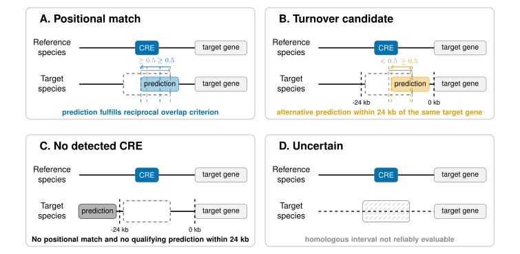

# CRE-state Classification

This workflow classifies the fixed *Drosophila melanogaster* reference CREs across all target species by combining homologous genomic positions from pairwise `liftOver`, species-specific SCRMshaw predictions, and standardized FlyBase FBgn target-gene associations.

Each reference CRE–species comparison is assigned one of four operational states:

```text
positional_match
turnover_candidate
no_detected_CRE
uncertain
```

These states form the basis of the downstream comparative, phylogenetic, sensitivity, and climate-related analyses. They represent computational evidence and should not be interpreted as direct experimental evidence of CRE function or loss.

---

## Workflow overview

For each *D. melanogaster* reference CRE, the workflow first determines whether its homologous genomic interval can be projected into the target species. Successfully mapped intervals are compared with target-species SCRMshaw predictions. If no positional match is detected, predictions associated with the same *D. melanogaster* FBgn target gene are evaluated within the local regulatory neighborhood.

<p align="center">
  
</p>

<p align="left">
  <em>
  Operational CRE states used for cross-species classification.
  (A) <code>positional_match</code>: a target-species prediction fulfills the reciprocal 50% overlap criterion at the projected homologous position.
  (B) <code>turnover_candidate</code>: no positional match is detected, but a prediction associated with the same candidate target gene occurs within the defined local regulatory neighborhood.
  (C) <code>no_detected_CRE</code>: neither a positional match nor a qualifying local same-gene prediction is detected.
  (D) <code>uncertain</code>: the reference CRE cannot be reliably projected into the target genome.
  States represent computational evidence rather than direct evidence of regulatory function.
  </em>
</p>

---

## Directory layout

```text
04_cre_classification/
├── config/
│   └── classification_config.sh
├── scripts/
│   ├── 01_classify_target_cres.py
│   ├── 02_combine_turnover_results.py
│   ├── 03_build_species_qc_summary.py
│   ├── summarize_dmel_cre_gene_distances.py
│   ├── summarize_prediction_source.py
│   ├── plot_cre_turnover.py
│   ├── plot_tree_heatmap.py
│   └── plot_clade_heatmaps.py
├── phylogeny/
│   ├── data/
│   └── results/
├── results/
│   ├── turnover_by_species/
│   └── figures/
└── run_cre_class_pipeline.sh
```

Paths, classification thresholds, expected dataset dimensions, and QC parameters are defined centrally in:

```text
config/classification_config.sh
```

---

## Core analysis defaults

The primary analysis uses:

| Parameter | Setting |
|---|---:|
| Reference CREs | 337 |
| Target species | 39 |
| Positional match | reciprocal overlap ≥ 0.50 |
| Local same-FBgn distance | ≤ 24 kb |
| Minimum mapping rate for QC | 0.50 |
| Minimum SCRMshaw peaks for QC | 50 |
| Minimum sequence-ID overlap for QC | 0.25 |
| Minimum mapped CREs for positional-overlap QC | 100 |
| High mapping-rate threshold for QC | 0.90 |

A positional match requires at least 50% overlap relative to both the lifted *D. melanogaster* CRE and the overlapping target-species prediction.

The 24 kb local-distance threshold was derived empirically from the distribution of *D. melanogaster* SCRMshaw CRE-to-associated-gene distances. The 95th percentile was approximately 23.6 kb and was rounded to 24 kb for the primary analysis.

---

## Input data

### D. melanogaster reference CREs

The fixed reference CRE set is obtained from:

```text
02_mapping_orthologs/reference_cres/dmel_reference_cres.tsv
```

Each CRE has a stable `dmel_cre_id`, genomic coordinates, and one or more associated FBgn target genes.

### Homologous target-genome intervals

Mapped reference CRE coordinates are obtained from:

```text
03_pairwise_wga/lifted_cres_dmel/<species>/
    dmel_reference_cres.<species>.bed
```

The target-species list is read from:

```text
03_pairwise_wga/target_species.txt
```

Reference CREs without a successfully projected interval cannot be evaluated positionally and are assigned `uncertain`.

### SCRMshaw predictions and FBgn associations

Target-species SCRMshaw predictions and their standardized FBgn associations are read from:

```text
02_mapping_orthologs/results/SO_all_species_fbgn.tsv
```

These data provide the target-species CRE intervals, associated genes, FBgn assignments, CRE-to-gene distances, and SCRMshaw prediction metadata required for positional and same-target-gene comparisons.

---

## Configuration

The main settings are defined in:

```text
config/classification_config.sh
```

Important variables include:

```text
REFERENCE_CRES_TSV
SO_ALL_SPECIES_FBGN

LIFTED_CRES_DIR
TARGET_SPECIES_FILE

RESULTS_DIR
TURNOVER_BY_SPECIES_DIR

RECIPROCAL_OVERLAP
LOCAL_GENE_DISTANCE

EXPECTED_REFERENCE_CRES

QC_MIN_MAPPING_RATE
QC_MIN_SCRMSHAW_PEAKS
QC_MIN_SEQID_OVERLAP
QC_MIN_MAPPED_FOR_OVERLAP_CHECK
QC_HIGH_MAPPING_RATE
```

Routine changes to thresholds or paths should be made in the configuration file rather than directly in the worker scripts.

---

## Run the classification workflow

From:

```text
04_cre_classification/
```

execute:

```bash
bash run_cre_class_pipeline.sh
```

The wrapper:

1. validates the required inputs and reference CRE count;
2. classifies all reference CREs independently for every target species;
3. combines the species-specific classifications;
4. generates a species-level QC summary.

For the primary dataset, every target-species result must contain exactly 337 reference CREs.

---

## Classification criteria

For mapped CREs, all SCRMshaw predictions on the corresponding target sequence are evaluated for positional overlap. The best overlapping prediction is retained together with the overlap in base pairs and the overlap fraction relative to both intervals.

The positional criterion is:

```text
overlap / lifted CRE length   >= 0.50
AND
overlap / target peak length >= 0.50
```

If no positional match is found, the workflow searches for predictions associated with any FBgn target gene assigned to the reference CRE. A prediction supports `turnover_candidate` only if its CRE-to-associated-gene distance is ≤ 24 kb.

FBgn agreement at a positional match is recorded separately as gene-support information rather than being part of the positional-match criterion. This keeps positional conservation and target-gene agreement analytically distinct.

The empirical CRE-to-gene distance distribution underlying the 24 kb threshold can be summarized with:

```text
scripts/summarize_dmel_cre_gene_distances.py
```

which writes:

```text
results/dmel_cre_gene_distance_summary.tsv
```

---

## Main outputs

### Species-specific classifications

```text
results/turnover_by_species/
    dmel_to_<species>_cre_turnover.tsv
```

Contains one row per reference CRE together with the final state and the diagnostic evidence supporting that assignment, including alignment status, lifted coordinates, overlap statistics, and same-FBgn information.

### Combined long-format table

```text
results/cre_turnover_all_species.tsv
```

Contains one row for every reference CRE–target species comparison.

For the primary dataset:

```text
337 reference CREs × 39 target species
```

### CRE-by-species matrix

```text
results/cre_turnover_matrix.tsv
```

Contains one reference CRE per row and one target species per column, with each cell storing one of the four CRE states.

This is the principal input for phylogenetic visualization and downstream candidate analyses.

### Species summary

```text
results/species_summary.tsv
```

Summarizes mapping status, CRE-state counts and rates, and FBgn support for each target species.

Rates are reported relative to both all reference CREs and evaluable CREs, where:

```text
evaluable CREs = mapped reference CREs
```

so `uncertain` comparisons are excluded from evaluable-rate denominators.

### Species-level QC

```text
results/species_qc_summary.tsv
```

Summarizes mapping rate, SCRMshaw prediction depth, sequence-ID compatibility, positional overlap, state composition, and same-FBgn support.

---

## Additional summaries and visualization

The following scripts operate on the completed classification tables and do not modify the underlying CRE-state assignments.

```text
scripts/plot_cre_turnover.py
```

generates species- and CRE-level summary figures and supporting tables.

```text
scripts/plot_tree_heatmap.py
```

visualizes the complete CRE-state matrix across the phylogeny together with climatic-zone annotations.

```text
scripts/plot_clade_heatmaps.py
```

generates focused CRE-state heatmaps for selected phylogenetic clades.

```text
scripts/summarize_prediction_source.py
```

compares SCRMshaw prediction depth between predictions generated within this project and externally supplied predictions as an additional technical QC.

Figures are written under:

```text
results/figures/
```

---

## Quality control

QC is performed independently of the biological state assignment:

| Stage | Main check |
|---|---|
| Input | expected reference CRE count and required upstream files |
| Species classification | exactly one result per reference CRE |
| Combined results | all CREs represented for every target species |
| Mapping | mapped versus unmapped reference CREs |
| Coordinate compatibility | sequence-ID agreement between lifted intervals and SCRMshaw predictions |
| Prediction coverage | number of SCRMshaw predictions per species |
| Positional comparison | occurrence of overlaps and reciprocal matches |
| Final dataset | only the four defined CRE states are accepted |

QC flags identify potentially unreliable species-level results but do not automatically redefine individual CRE states.

---

## Adapting the workflow

The positional-overlap criterion is controlled through:

```text
RECIPROCAL_OVERLAP
```

and the local regulatory-neighborhood threshold through:

```text
LOCAL_GENE_DISTANCE
```

in `config/classification_config.sh`.

Changing either parameter changes the operational CRE-state definition and therefore represents a distinct analysis setting.

Changes to the reference CRE set require adjustment of:

```text
EXPECTED_REFERENCE_CRES
```

QC thresholds can be modified through the corresponding `QC_*` variables without changing the primary classification rules.

Systematic evaluation of alternative overlap and distance thresholds is performed separately in the downstream sensitivity analysis.

---

## Reproducibility

The workflow retains the evidence underlying every CRE-state assignment, including homologous target coordinates, positional-overlap statistics, same-FBgn support, local candidate information, and alignment status. Species-specific classifications are combined without altering the individual assignments, allowing each entry in the final CRE-state matrix to be traced back to the corresponding *D. melanogaster* reference CRE, pairwise coordinate projection, and target-species SCRMshaw prediction data.

Classification parameters and QC thresholds are centralized in `config/classification_config.sh`, while summary and visualization scripts operate on the completed classification tables without modifying them.
