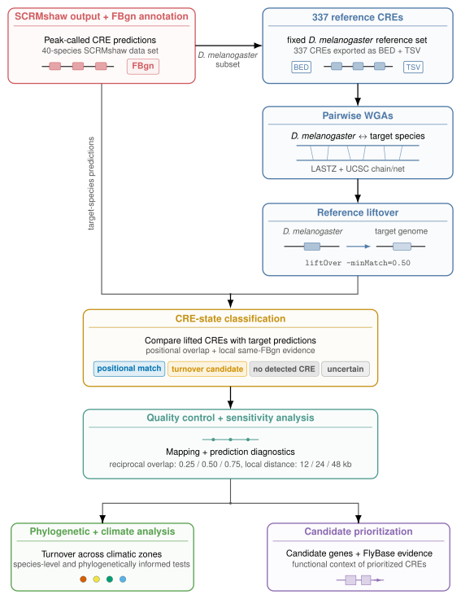

# Comparative CRE Turnover in Drosophila

A reproducible comparative-genomics workflow for identifying and characterizing cis-regulatory element (CRE) conservation and turnover across a 40-species *Drosophila* framework.

The analysis is anchored on a fixed set of 337 *Drosophila melanogaster* reference CREs. Species-specific SCRMshaw predictions are standardized and linked through their *D. melanogaster* FBgn target-gene assignments, while homologous reference positions are identified using independent pairwise whole-genome alignments. These complementary sources of evidence are combined to classify each reference-CRE/species comparison into one of four operational CRE states.

Downstream analyses identify recurrent focal-lineage candidates, assess the robustness of CRE-state assignments, and evaluate associations between regulatory divergence and climatic zone.

The workflow is organized into five major stages:

1. SCRMshaw prediction generation and integration
2. FBgn target-gene mapping and construction of the reference CRE set
3. Pairwise whole-genome alignment and CRE liftover
4. CRE-state classification
5. Candidate, sensitivity, and climate analyses

> **Important:** `turnover_candidate` and `no_detected_CRE` are conservative computational labels. They do not by themselves demonstrate experimentally confirmed regulatory turnover or CRE loss.

---

## Workflow overview

<p align="center">
  
</p>

SCRMshaw prediction generation, filtering, post-processing, and integration are documented in detail in [`01_scrmshaw/`](01_scrmshaw/). Each subsequent workflow stage contains its own README describing stage-specific inputs, parameters, QC procedures, outputs, and adaptation points.

---

## Repository structure

```text
cre_turnover/
├── 01_scrmshaw/
│   ├── generation/          # de novo SCRMshaw-HD prediction
│   └── external/            # integration of existing SCRMshaw predictions
├── 02_mapping_orthologs/    # FBgn target-gene mapping and Dmel reference CRE set
├── 03_pairwise_wga/         # pairwise Dmel-target alignments and liftOver
├── 04_cre_classification/   # CRE-state classification, phylogeny, and global QC
└── 05_downstream_analyses/
    ├── 01_candidate_analysis/
    ├── 02_sensitivity_analysis/
    └── 03_climate_analysis/
```

The numbered directories reflect the intended execution order of the workflow.

---

## Core analysis defaults

The primary analysis uses the following central settings:

| Component | Default |
|---|---|
| Species framework | 40 species including *D. melanogaster* |
| Target species | 39 |
| Reference CREs | 337 |
| SCRMshaw training set | `adult_muscle` |
| SCRMshaw scoring method | `imm` |
| Positional CRE criterion | reciprocal overlap ≥ 0.50 |
| Local same-target-gene distance | 24 kb |
| liftOver minimum mapped fraction | 0.50 |

Additional SCRMshaw, sensitivity-analysis, computational-resource, and QC parameters are documented in the corresponding stage READMEs and configuration files.

---

## CRE-state definitions

Each reference-CRE/target-species comparison is assigned one of four operational states.

| State | Interpretation |
|---|---|
| `positional_match` | The reference CRE was successfully mapped and a target-species SCRMshaw prediction satisfied the positional reciprocal-overlap criterion. |
| `turnover_candidate` | The homologous reference interval was mapped but lacked a positional CRE match, while another SCRMshaw prediction associated with the same FBgn target gene was detected within the local distance threshold. |
| `no_detected_CRE` | The homologous interval was mapped, but neither a positional CRE prediction nor a qualifying local same-target-gene prediction was detected. |
| `uncertain` | The reference CRE could not be reliably projected into the target genome and therefore cannot be evaluated for CRE conservation or turnover. |

These states describe computational evidence. In particular, absence of a detected CRE prediction is not interpreted as definitive biological loss.

---

## Input data

The complete workflow requires several genomic and comparative-genomics resources. Large source datasets are not stored directly in the repository.

| Input | Purpose |
|---|---|
| Species list | Defines the species included in the analysis and their workflow identifiers |
| Genome FASTA files | SCRMshaw prediction and pairwise whole-genome alignment |
| GFF3 genome annotations | Gene-coordinate information and SCRMshaw post-processing |
| Existing SCRMshaw predictions | Previously generated predictions incorporated into the common prediction framework |
| SCRMshaw-associated FBgn target-gene assignments | Cross-species comparison of CREs associated with the same *D. melanogaster* target gene |
| Species phylogeny (Newick) | Species relationships, ordering, and phylogenetically controlled analyses |
| Species climate annotations | Climatic-zone and focal-lineage analyses |

The species list defines which species are included in the analysis. Species identifiers must follow the naming conventions expected by the individual workflow stages and associated metadata.

The phylogenetic tree must contain the analyzed species in Newick format. Where file slugs and tree labels differ, the corresponding mapping is handled by the relevant metadata files.

No separate external orthology database is required by the final workflow; the target-gene associations used here are derived from FBgn identifiers already present in the SCRMshaw-associated data.

Exact filenames, directory layouts, and source-data requirements are documented in the corresponding stage READMEs.

---

## Software and computational environment

The final workflow was executed using the following core software:

| Software | Version | Main use |
|---|---:|---|
| SCRMshaw-HD | 1.1 | CRE prediction |
| LASTZ | 1.04.58 | Pairwise whole-genome alignment |
| UCSC Kent utilities | version not reported by installed binaries | Chain/net processing and coordinate projection |
| Python | 3.10.20 | Workflow and downstream analyses |
| R | 4.2.2 | Phylogenetically controlled climate analysis |
| GNU Bash | 5.2.15 | Pipeline orchestration |
| SLURM | 22.05.8 | Scheduling of computationally intensive species-wise jobs |

SCRMshaw generation uses dedicated reproducible software environments provided under:

```text
01_scrmshaw/generation/envs/
```

Stage-specific software dependencies and configuration requirements are documented in the corresponding README files.

---

## Running the workflow

The project is divided into independent stages rather than a single monolithic runner. Computationally expensive intermediate results can therefore be validated and reused without repeating unrelated upstream analyses.

### 1. Generate and integrate SCRMshaw predictions

#### Generate de novo predictions

```bash
cd 01_scrmshaw/generation
bash submit_pipeline.sh
```

Generates and post-processes SCRMshaw predictions for species analyzed directly within this project.

See [`01_scrmshaw/generation/`](01_scrmshaw/generation/) for input preparation, SCRMshaw parameters, SLURM execution, and QC.

#### Integrate external predictions

```bash
cd ../external
bash run_external_pipeline.sh
```

Filters, validates, and post-processes previously generated SCRMshaw predictions and combines them with the newly generated species.

**Main outputs:**

```text
combined_manifest.tsv
combined_results/<species>/peaks_AllSets.bed
```

See [`01_scrmshaw/external/`](01_scrmshaw/external/) for external input formats, filtering criteria, QC, and restart behavior.

---

### 2. Build the FBgn-linked prediction dataset and reference CRE set

```bash
cd ../../02_mapping_orthologs
bash scripts/run_ortholog_pipeline.sh
```

Standardizes the existing FBgn target-gene associations across species and constructs the fixed set of 337 *D. melanogaster* reference CREs.

**Main outputs include:**

```text
SO_all_species_fbgn.tsv
```

and the reference-CRE dataset used by all subsequent stages.

See [`02_mapping_orthologs/`](02_mapping_orthologs/) for identifier handling, reference-set construction, and QC.

---

### 3. Build pairwise whole-genome alignments and project reference CREs

```bash
cd ../03_pairwise_wga
bash run_pairwise_wga_pipeline.sh
```

Generates independent *D. melanogaster*–target-species alignments and projects the reference CRE coordinates into each target genome.

**Main outputs:** pairwise alignment chains and mapped/unmapped reference-CRE intervals for the 39 target species.

See [`03_pairwise_wga/`](03_pairwise_wga/) for alignment parameters, chain/net processing, liftOver settings, and mapping QC.

---

### 4. Classify CRE states

```bash
cd ../04_cre_classification
bash scripts/run_cre_classification_pipeline.sh
```

Combines positional homology, SCRMshaw prediction evidence, and FBgn target-gene associations to assign one CRE state to each reference-CRE/target-species comparison.

**Main output:**

```text
results/cre_turnover_matrix.tsv
```

See [`04_cre_classification/`](04_cre_classification/) for classification logic, QC, phylogenetic metadata, and state-level evidence.

---

### 5. Run downstream analyses

#### Candidate analysis

```bash
cd ../05_downstream_analyses/01_candidate_analysis
bash run_candidate_analysis.sh
```

Identifies recurrent focal-lineage CRE patterns and candidate turnover events.

#### Sensitivity analysis

```bash
cd ../02_sensitivity_analysis
bash run_sensitivity_analysis.sh
```

Evaluates whether conclusions remain stable across alternative CRE-classification thresholds.

#### Climate analysis

```bash
cd ../03_climate_analysis
bash run_climate_pipeline.sh
```

Evaluates associations between regulatory divergence and climatic zone, including phylogenetically controlled analyses.

Detailed methods, parameters, statistical tests, and outputs are documented within the corresponding downstream-analysis directories.

---

## Key outputs

The central comparative result is:

```text
04_cre_classification/results/cre_turnover_matrix.tsv
```

which contains the CRE-state assignment for every reference-CRE/target-species comparison.

The principal downstream results are produced under:

```text
05_downstream_analyses/01_candidate_analysis/
05_downstream_analyses/02_sensitivity_analysis/
05_downstream_analyses/03_climate_analysis/
```

These directories contain the candidate, robustness, and climate-associated analyses used for biological interpretation.

---

## Adapting the workflow

Paths, species definitions, biological thresholds, and compute resources are controlled through stage-specific configuration files wherever possible.

Changes should be made in the configuration or metadata files documented by the relevant workflow stage rather than directly in worker scripts. When an upstream biological parameter or species set is changed, all dependent downstream products should be regenerated.

---

## Reproducibility

The workflow separates CRE prediction, data harmonization, target-gene annotation, coordinate projection, CRE-state classification, quality control, statistical analysis, and plotting.

Intermediate results are retained where needed for traceability, allowing final candidate calls, statistical results, and figures to be linked back to their underlying species-level evidence.

For implementation details and exact reproducibility requirements, refer to the README within the corresponding workflow directory.
