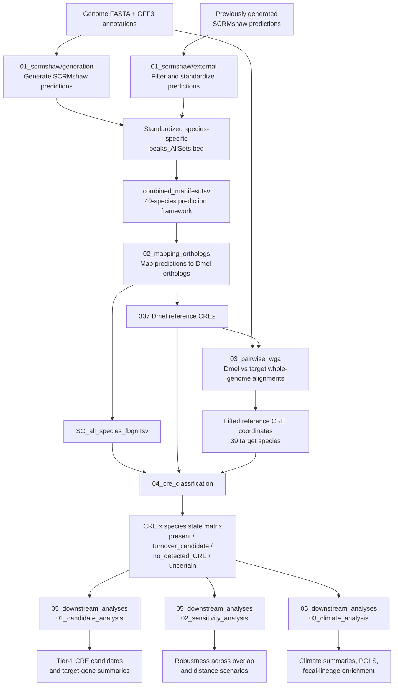

# Comparative CRE Turnover in Drosophila

A reproducible comparative-genomics workflow for identifying and characterizing cis-regulatory element (CRE) conservation and turnover across a 40-species *Drosophila* framework.

The analysis is anchored on a fixed set of 337 *Drosophila melanogaster* reference CREs. SCRMshaw predictions are standardized across species, linked to *D. melanogaster* orthologous target genes, projected through independent pairwise whole-genome alignments, and classified into four operational CRE states. Downstream analyses then identify recurrent focal-lineage candidates, test parameter sensitivity, and evaluate associations with climatic zone.

The workflow is organized into five major stages:

1. SCRMshaw prediction generation and integration
2. Ortholog mapping and construction of the reference CRE set
3. Pairwise whole-genome alignment and CRE liftover
4. CRE-state classification
5. Candidate, sensitivity, and climate analyses

> **Important:** `turnover_candidate` and `no_detected_CRE` are conservative computational labels. They do not by themselves demonstrate experimentally confirmed regulatory turnover or CRE loss.

## Workflow overview



## Repository structure

```text
cre_turnover/
├── 01_scrmshaw/
│   ├── generation/          # de novo SCRMshaw-HD prediction
│   └── external/            # standardization of existing predictions
├── 02_mapping_orthologs/    # ortholog annotation and Dmel reference CRE set
├── 03_pairwise_wga/         # pairwise Dmel-target alignments and liftOver
├── 04_cre_classification/   # CRE-state classification and global QC
└── 05_downstream_analyses/  
    ├── 01_candidate_analysis/
    ├── 02_sensitivity_analysis/
    └── 03_climate_analysis/
```

Each major stage has its own `README.md` with stage-specific inputs, outputs, defaults, and adaptation points.

## Core analysis defaults

The current analysis uses the following primary settings:

| Component | Default |
|---|---|
| Species framework | 40 species including *D. melanogaster* |
| Reference CREs | 337 |
| SCRMshaw training set | `adult_muscle` |
| SCRMshaw scoring method | `imm` |
| SCRMshaw HD offsets | 25 offsets, 0-240 bp in 10-bp steps |
| SCRMshaw hit depth | `--thitw 10000` |
| Retained ranked hits | top 5,000 per offset |
| Positional CRE criterion | reciprocal overlap >= 0.50 |
| Local same-target-gene distance | 24 kb |
| liftOver minimum mapped fraction | 0.50 |
| Sensitivity overlap grid | 0.25, 0.50, 0.75 |
| Sensitivity distance grid | 12 kb, 24 kb, 48 kb |
| Primary sensitivity scenario | `ov050_dist24000` |

Values that are intended to be user-adjustable are centralized in the relevant `config/*.sh` files.

## Requirements

The full workflow combines Python, R, command-line comparative-genomics tools, SCRMshaw, and SLURM.

### Python

Common Python dependencies include:

- Python 3
- pandas
- numpy
- matplotlib
- scipy
- Biopython for tree/sequence utilities where required

### R

The phylogenetically controlled climate analysis requires:

- `ape`
- `nlme`

### Comparative-genomics tools

The pairwise alignment stage requires LASTZ and UCSC command-line utilities, including:

- `faToTwoBit`
- `twoBitInfo`
- `axtChain`
- `chainSort`
- `chainPreNet`
- `chainNet`
- `netSyntenic`
- `netChainSubset`
- `liftOver`

### SCRMshaw

The de novo prediction stage uses SCRMshaw-HD and its post-processing tools. Environment definitions are provided in:

```text
01_scrmshaw/generation/envs/
```

### Compute environment

SCRMshaw generation and pairwise whole-genome alignment are designed for SLURM execution. Resource settings are controlled through the corresponding configuration files.

## How to run the complete workflow

The project is intentionally split into stages rather than hidden behind one monolithic runner. This makes long-running SLURM jobs easier to inspect, restart, and reproduce.

### 1. Generate new SCRMshaw predictions

```bash
cd 01_scrmshaw/generation
bash submit_pipeline.sh
```

Wait until all required species have successfully completed scanning and post-processing.

### 2. Standardize external predictions and build the combined prediction set

```bash
cd ../external
bash run_external_pipeline.sh
```

This produces the standardized `combined_results/` directory and `combined_manifest.tsv`.

### 3. Map predictions to D. melanogaster orthologs

```bash
cd ../../02_mapping_orthologs
bash scripts/run_ortholog_pipeline.sh
```

This stage also constructs the fixed set of 337 *D. melanogaster* reference CREs.

### 4. Build pairwise whole-genome alignments and project the reference CREs

```bash
cd ../03_pairwise_wga
bash run_pairwise_wga_pipeline.sh
```

The species-wise alignment jobs are submitted through SLURM. Confirm that all required alignments are complete before running or interpreting the liftOver stage.

### 5. Classify CRE states

```bash
cd ../04_cre_classification
bash scripts/run_cre_classification_pipeline.sh
```

The main result is `results/cre_turnover_matrix.tsv`, containing one CRE state per reference-CRE/target-species comparison.

### 6. Run downstream analyses

```bash
cd ../05_downstream_analyses/01_candidate_analysis
bash run_candidate_analysis.sh

cd ../02_sensitivity_analysis
bash run_sensitivity_analysis.sh

cd ../03_climate_analysis
bash run_climate_pipeline.sh
```

If a checkout still keeps a downstream wrapper under `scripts/`, invoke the same wrapper filename from that directory. The refactored analysis scripts receive paths and methodological parameters explicitly from their config-backed wrappers.

## How to adapt the workflow

The preferred place to change paths, biological thresholds, or compute resources is the relevant configuration file rather than the worker scripts.

Common adaptations include:

- adding or removing species in the species files or manifest;
- changing SCRMshaw training set, scoring method, or candidate depth;
- changing SLURM node, memory, or concurrency;
- changing the reciprocal-overlap or local-distance criteria;
- editing focal-clade definitions in `05_downstream_analyses/01_candidate_analysis/config/focal_clades.tsv`;
- changing the sensitivity grid in `sensitivity_config.sh`;
- changing climatic-zone annotations in `04_cre_classification/phylogeny/data/species_traits.tsv`.

If the species framework changes, regenerate all downstream products that depend on species identity or ordering. If the primary CRE-classification thresholds change, rerun classification and all downstream analyses.

## Reproducibility notes

The workflow separates data preparation, biological classification, QC, statistical analysis, and plotting.

Plotting scripts should consume already generated analysis tables rather than independently recalculating statistical models. Config files contain important paths, methodological thresholds, and compute resources; plot aesthetics remain local to plotting scripts.

Intermediate files are retained where they are useful for auditability, especially:

- standardized SCRMshaw predictions;
- ortholog mapping tables;
- mapped and unmapped liftOver intervals;
- per-species CRE classifications;
- QC summaries;
- sensitivity scenario outputs.

This makes it possible to trace a final candidate or figure back to the species-level evidence on which it is based.
