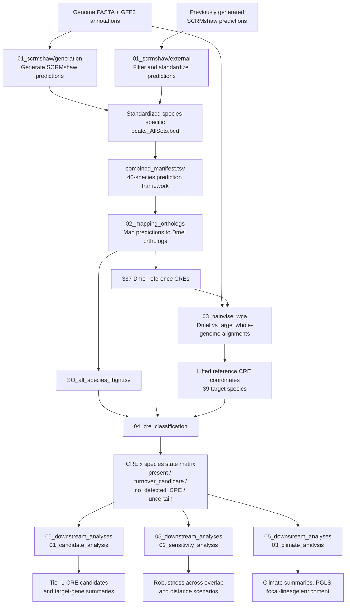

# Comparative CRE Turnover in Drosophila

A reproducible comparative-genomics workflow for identifying and characterizing cis-regulatory element (CRE) conservation and turnover across a 40-species *Drosophila* framework.

The analysis is anchored on a fixed set of 337 *Drosophila melanogaster* reference CREs. SCRMshaw predictions are standardized across species, linked to *D. melanogaster* orthologous target genes, projected through independent pairwise whole-genome alignments, and classified into four operational CRE states. Downstream analyses identify recurrent focal-lineage candidates, assess parameter sensitivity, and evaluate associations between regulatory divergence and climatic zone.

The workflow consists of five major stages:

1. SCRMshaw prediction generation and integration
2. Ortholog mapping and construction of the reference CRE set
3. Pairwise whole-genome alignment and CRE liftover
4. CRE-state classification
5. Candidate, sensitivity, and climate analyses

> **Important:** `turnover_candidate` and `no_detected_CRE` are conservative computational labels. They do not by themselves demonstrate experimentally confirmed regulatory turnover or CRE loss.

---

## Workflow overview



Stages are intended to be executed sequentially. Validated intermediate results can be reused, so computationally expensive SCRMshaw scans and pairwise whole-genome alignments do not need to be repeated when only downstream analyses are rerun.

---

## Repository structure

```text
cre_turnover/
├── 01_scrmshaw/
│   ├── generation/          # de novo SCRMshaw-HD prediction
│   └── external/            # filtering and standardization of existing predictions
├── 02_mapping_orthologs/    # ortholog annotation and Dmel reference CRE set
├── 03_pairwise_wga/         # pairwise Dmel-target alignments and liftOver
├── 04_cre_classification/   # CRE-state classification, phylogeny data, and global QC
└── 05_downstream_analyses/
    ├── 01_candidate_analysis/
    ├── 02_sensitivity_analysis/
    └── 03_climate_analysis/
```

Each major workflow directory contains its own `README.md` with detailed input schemas, configuration options, QC procedures, and output descriptions.

---

## Core analysis defaults

| Component                        | Default                                |
| -------------------------------- | -------------------------------------- |
| Species framework                | 40 species including *D. melanogaster* |
| Target species                   | 39                                     |
| Reference CREs                   | 337                                    |
| SCRMshaw training set            | `adult_muscle`                         |
| SCRMshaw scoring method          | `imm`                                  |
| SCRMshaw-HD offsets              | 25 offsets, 0–240 bp in 10-bp steps    |
| SCRMshaw hit depth               | `--thitw 10000`                        |
| Retained ranked hits             | top 5,000 per offset                   |
| Positional CRE criterion         | reciprocal overlap ≥ 0.50              |
| Local same-target-gene distance  | 24 kb                                  |
| liftOver minimum mapped fraction | 0.50                                   |
| Sensitivity overlap grid         | 0.25, 0.50, 0.75                       |
| Sensitivity distance grid        | 12 kb, 24 kb, 48 kb                    |
| Primary sensitivity scenario     | `ov050_dist24000`                      |

User-adjustable paths, biological thresholds, and compute settings are defined in the relevant configuration files rather than in the analysis workers wherever possible.

---

## CRE-state definitions

Each reference-CRE/target-species comparison is assigned one of four operational states.

| State                | Interpretation                                                                                                                                                                                                           |
| -------------------- | ------------------------------------------------------------------------------------------------------------------------------------------------------------------------------------------------------------------------ |
| `present`            | The reference CRE was successfully mapped and a target-species SCRMshaw prediction satisfied the positional reciprocal-overlap criterion.                                                                                |
| `turnover_candidate` | The homologous reference interval was mapped but lacked a positional CRE match, while a different SCRMshaw prediction associated with the same orthologous target gene was detected within the local distance threshold. |
| `no_detected_CRE`    | The homologous interval was mapped, but neither a positional CRE prediction nor a qualifying local same-target-gene prediction was detected.                                                                             |
| `uncertain`          | The reference CRE could not be reliably projected into the target genome and therefore cannot be evaluated for CRE conservation or turnover.                                                                             |

These labels describe computational evidence only. In particular, absence of a detected prediction is not interpreted as definitive biological loss.

---

## Input data

The full workflow requires several external genomic and comparative-genomics resources. Large source datasets are not stored directly in the repository.

| Input                                  | Purpose                                                                     | Used in                                                               |
| -------------------------------------- | --------------------------------------------------------------------------- | --------------------------------------------------------------------- |
| Genome FASTA files                     | SCRMshaw scanning and pairwise whole-genome alignment                       | `01_scrmshaw`, `03_pairwise_wga`                                      |
| GFF3 genome annotations                | Gene coordinates and SCRMshaw preprocessing                                 | `01_scrmshaw`                                                         |
| Existing SCRMshaw predictions          | Integration of externally generated prediction sets                         | `01_scrmshaw/external`                                                |
| Orthology mapping data                 | Mapping species-specific target genes to *D. melanogaster* FBgn identifiers | `02_mapping_orthologs`                                                |
| *D. melanogaster* SCRMshaw predictions | Construction of the reference CRE set                                       | `02_mapping_orthologs`                                                |
| Species phylogeny                      | Species ordering and phylogenetically controlled analyses                   | `04_cre_classification`, `05_downstream_analyses`                     |
| Species climate annotations            | Climate-zone and focal-lineage analyses                                     | `04_cre_classification`, `05_downstream_analyses/03_climate_analysis` |

Exact filenames, expected directory locations, preprocessing requirements, and external data sources are documented in the README of the corresponding workflow stage.

---

## Requirements

The workflow combines Python, R, SCRMshaw-HD, comparative-genomics command-line tools, and SLURM-based compute jobs.

### Python

Common dependencies include:

* Python 3
* pandas
* numpy
* matplotlib
* scipy
* Biopython

Additional stage-specific dependencies are documented within the respective workflow directories.

### R

The phylogenetically controlled climate analysis requires:

* `ape`
* `nlme`

### Comparative-genomics tools

Pairwise whole-genome alignment and coordinate projection require LASTZ and UCSC command-line utilities.

The primary workflow uses LASTZ 1.04.58 together with:

* `faToTwoBit`
* `twoBitInfo`
* `axtChain`
* `chainSort`
* `chainPreNet`
* `chainNet`
* `netSyntenic`
* `netChainSubset`
* `liftOver`

### SCRMshaw

The de novo prediction stage uses SCRMshaw-HD and its associated post-processing tools.

Environment definitions are provided under:

```text
01_scrmshaw/generation/envs/
```

### Compute environment

SCRMshaw generation and pairwise whole-genome alignment are designed for execution on a SLURM cluster.

Before running the workflow, verify the configured:

* input-data paths;
* species lists and manifests;
* SCRMshaw installation;
* LASTZ and UCSC utilities;
* orthology resources;
* SLURM resources;
* phylogeny and climate metadata.

---

## How to run the complete workflow

The project is split into independent stages rather than a single monolithic runner. This makes long-running jobs easier to inspect, restart, validate, and reproduce.

Run the stages in the following order.

### 1. Generate de novo SCRMshaw predictions

```bash
cd 01_scrmshaw/generation
bash submit_pipeline.sh
```

**Input:** genome FASTA files, genome annotations, and SCRMshaw training data.

**Main output:** species-specific SCRMshaw predictions, including standardized `peaks_AllSets.bed` files.

SCRMshaw scanning and post-processing may run as multiple SLURM jobs. Verify successful completion using the stage-specific QC checks before continuing.

---

### 2. Standardize external predictions and build the combined prediction framework

```bash
cd ../external
bash run_external_pipeline.sh
```

**Input:** previously generated external predictions and de novo predictions from Stage 1.

**Main outputs:**

```text
combined_results/
combined_manifest.tsv
```

All prediction sets are filtered into a consistent representation and integrated into the common species framework.

Before continuing, confirm that all intended species are represented in `combined_manifest.tsv`.

---

### 3. Map predictions to *D. melanogaster* orthologs

```bash
cd ../../02_mapping_orthologs
bash scripts/run_ortholog_pipeline.sh
```

**Input:** standardized SCRMshaw predictions and orthology mapping resources.

**Main outputs:**

```text
SO_all_species_fbgn.tsv
```

and the fixed set of 337 *D. melanogaster* reference CREs.

Species-specific predictions are linked to orthologous *D. melanogaster* target-gene identifiers, providing a common FBgn-based reference system for cross-species comparison.

---

### 4. Build pairwise whole-genome alignments and project reference CREs

```bash
cd ../03_pairwise_wga
bash run_pairwise_wga_pipeline.sh
```

**Input:** *D. melanogaster* and target-species genome FASTA files, together with the reference CRE set.

**Main outputs:**

* pairwise *D. melanogaster*–target chain files;
* successfully lifted CRE intervals;
* unmapped CRE intervals;
* per-species mapping summaries.

Independent pairwise whole-genome alignments are generated using LASTZ followed by the UCSC chain/net workflow. The resulting syntenic chains are used with `liftOver` to project each reference CRE into the corresponding target genome.

Unmapped CREs are retained as non-evaluable rather than interpreted as losses.

Before continuing, verify that mapped and unmapped CRE counts are consistent with the complete reference set.

---

### 5. Classify CRE states

```bash
cd ../04_cre_classification
bash scripts/run_cre_classification_pipeline.sh
```

**Input:** ortholog-annotated SCRMshaw predictions, reference CREs, and lifted homologous intervals.

**Main output:**

```text
results/cre_turnover_matrix.tsv
```

The matrix contains one operational CRE state for each reference-CRE/target-species comparison.

The primary classification uses:

* reciprocal positional overlap ≥ 0.50;
* local same-target-gene distance ≤ 24 kb;
* liftOver minimum mapped fraction of 0.50.

Species-level evidence and QC summaries are retained so that each state assignment can be traced back to its supporting data.

---

### 6. Run downstream analyses

#### Candidate analysis

```bash
cd ../05_downstream_analyses/01_candidate_analysis
bash run_candidate_analysis.sh
```

Identifies recurrent focal-lineage CRE patterns and summarizes Tier-1 candidate CREs and associated target genes.

#### Sensitivity analysis

```bash
cd ../02_sensitivity_analysis
bash run_sensitivity_analysis.sh
```

Evaluates the robustness of CRE-state assignments and downstream conclusions across alternative overlap and distance thresholds.

Default grid:

```text
Overlap:  0.25, 0.50, 0.75
Distance: 12 kb, 24 kb, 48 kb
```

Primary scenario:

```text
ov050_dist24000
```

#### Climate analysis

```bash
cd ../03_climate_analysis
bash run_climate_pipeline.sh
```

Evaluates associations between regulatory divergence and climatic zone using descriptive summaries, focal-lineage comparisons, enrichment analyses, and phylogenetically controlled models where applicable.

---

## Key outputs

The central result of the workflow is:

```text
04_cre_classification/results/cre_turnover_matrix.tsv
```

This matrix contains the primary CRE-state assignment for every reference-CRE/target-species comparison and serves as the main input for all downstream analyses.

Additional biological results are written to:

```text
05_downstream_analyses/01_candidate_analysis/
05_downstream_analyses/02_sensitivity_analysis/
05_downstream_analyses/03_climate_analysis/
```

These directories contain, respectively:

* recurrent focal-lineage and Tier-1 CRE candidates;
* robustness results across alternative classification thresholds;
* climate-associated summaries and phylogenetically controlled analyses.

Intermediate evidence and QC files are retained throughout the workflow to support traceability of final candidate calls and figures.

---

## Adapting the workflow

Paths, biological thresholds, species definitions, and compute resources should be changed through the relevant configuration files rather than directly in worker scripts.

Common adaptations include:

* adding or removing species;
* changing the SCRMshaw training set or scoring method;
* changing retained prediction depth;
* changing SLURM memory, node, partition, or concurrency;
* changing the reciprocal-overlap criterion;
* changing the local same-target-gene distance threshold;
* editing focal-clade definitions;
* changing the sensitivity-analysis grid;
* updating climatic-zone annotations.

Focal-clade definitions are maintained in:

```text
05_downstream_analyses/01_candidate_analysis/config/focal_clades.tsv
```

Climate and species-trait annotations used by the current analysis are stored in:

```text
04_cre_classification/phylogeny/data/species_traits.tsv
```

Changes to species composition, SCRMshaw settings, or primary CRE-classification thresholds require regeneration of the affected downstream products. Purely visual changes to plotting scripts do not require statistical analyses or biological classifications to be rerun.

---

## Reproducibility

The workflow keeps data preparation, CRE prediction, orthology mapping, coordinate projection, classification, QC, statistical analysis, and plotting as separate steps.

Plotting scripts consume precomputed analysis tables rather than independently recalculating biological classifications or statistical models.

Intermediate files are retained where they are useful for auditability, including:

* standardized SCRMshaw predictions;
* ortholog mapping tables;
* reference-CRE definitions;
* pairwise alignment chains;
* mapped and unmapped liftOver intervals;
* per-species CRE classifications;
* QC summaries;
* sensitivity-scenario outputs.

This structure allows final candidates, statistical results, and figures to be traced back to the species-level evidence from which they were derived.
